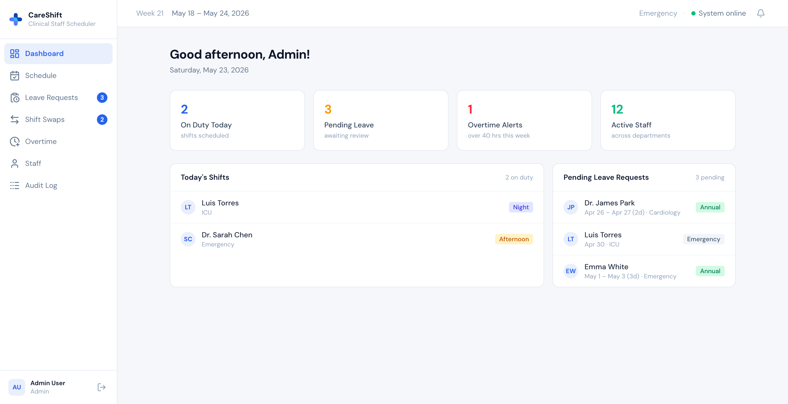
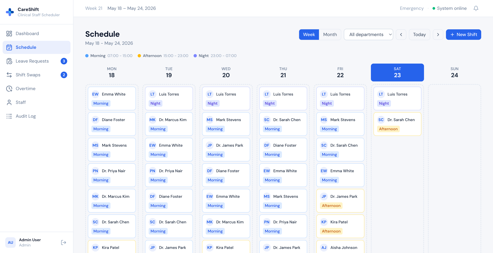
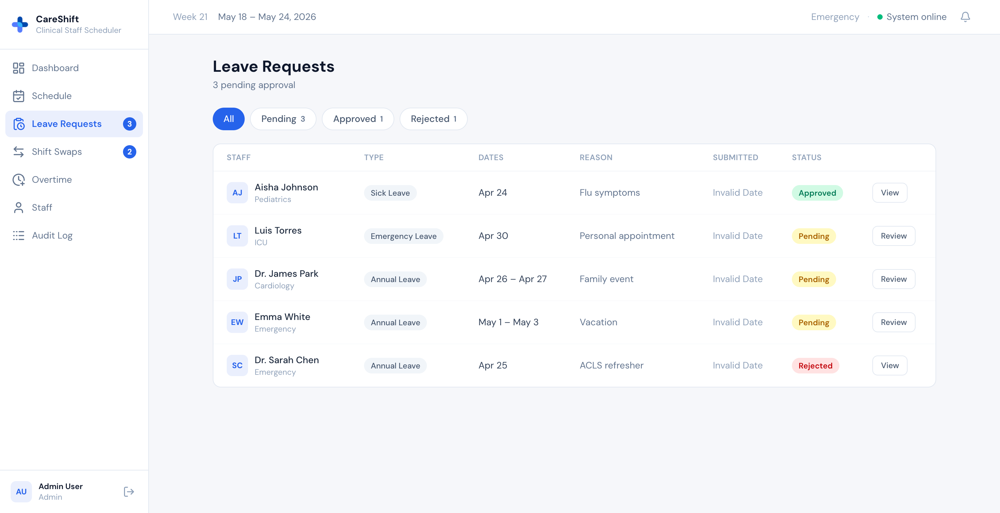
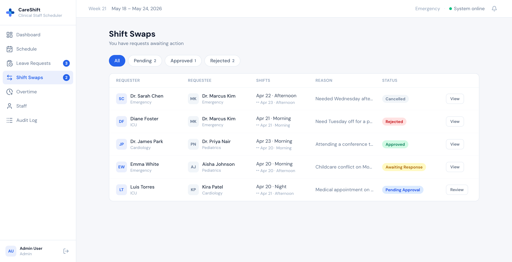
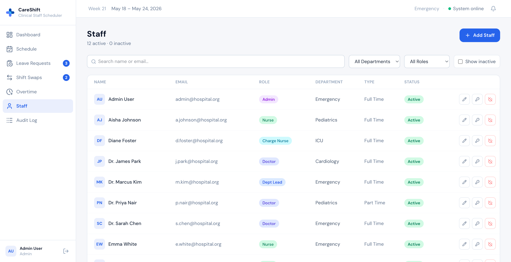
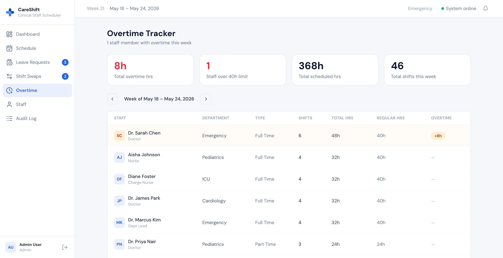
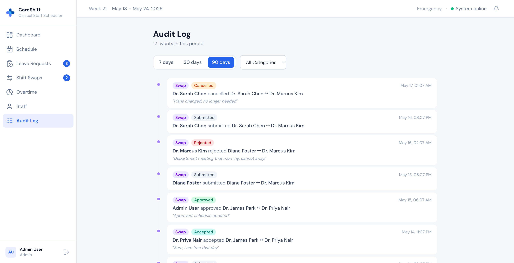
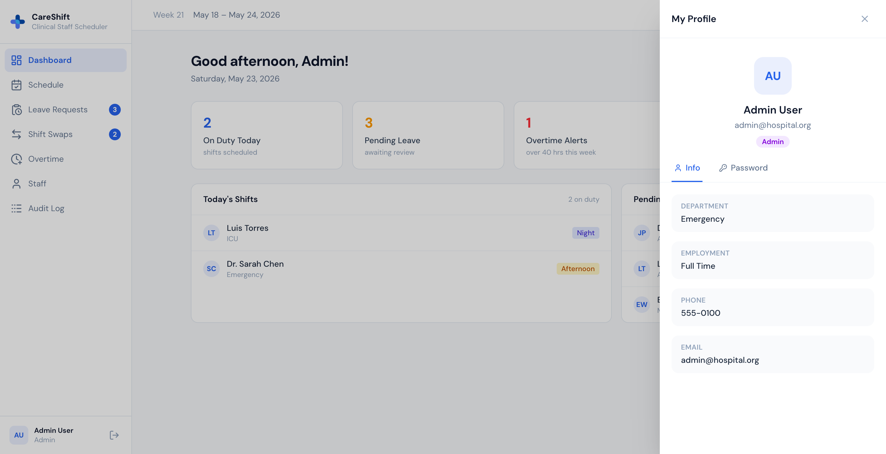
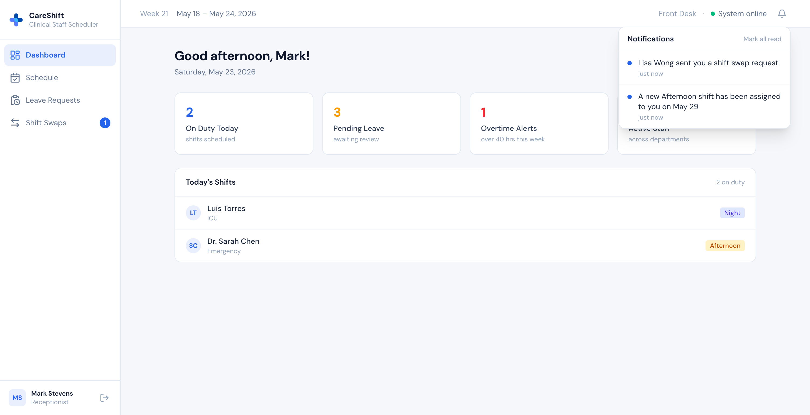
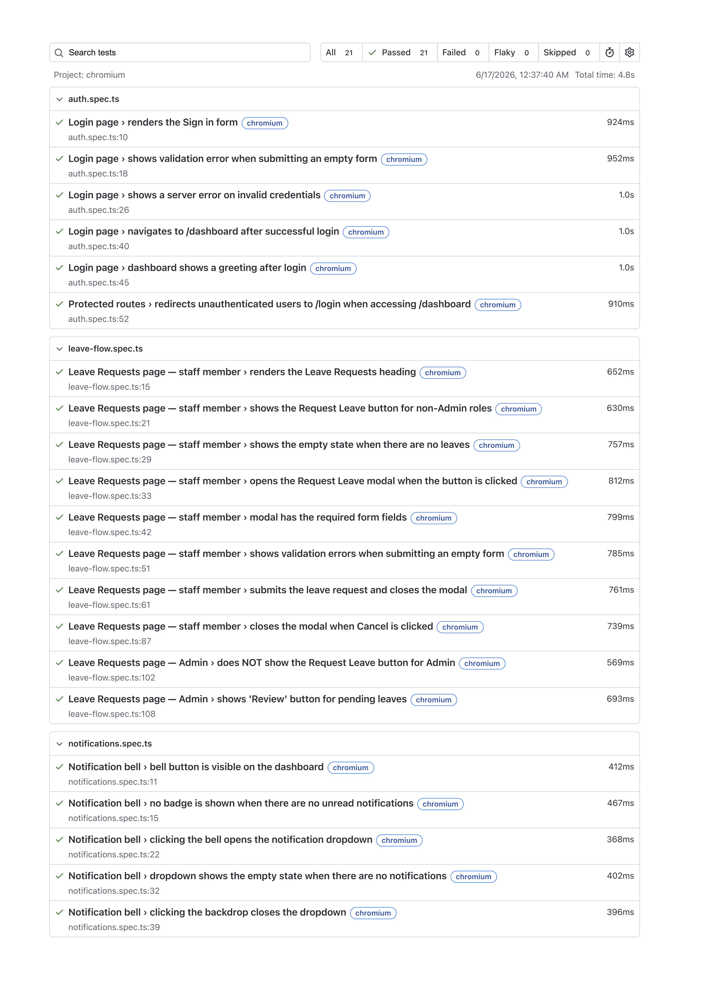

# CareShift — Clinical Staff Scheduling Platform

A full-stack responsive application for managing clinical staff schedules, leave requests, shift swaps, and workforce analytics. Built with Clean Architecture on ASP.NET Core 10 and React 19, with real-time updates via SignalR.

---

## Table of Contents

1. [Overview](#1-overview)
2. [Screenshots](#2-screenshots)
3. [Technology Stack](#3-technology-stack)
4. [Architecture](#4-architecture)
5. [Project Structure](#5-project-structure)
6. [Domain Model](#6-domain-model)
7. [Role Permissions](#7-role-permissions)
8. [Feature Modules](#8-feature-modules)
9. [Approval Workflows](#9-approval-workflows)
10. [Authentication & Security](#10-authentication--security)
11. [Real-Time Notifications](#11-real-time-notifications)
12. [API Reference](#12-api-reference)
13. [Testing](#13-testing)
14. [Getting Started](#14-getting-started)
15. [License](#15-license)

---

## 1. Overview

CareShift addresses the operational challenges of managing clinical staff across multiple departments. It provides:

- A weekly and monthly **schedule view** with drag-and-drop shift management
- A structured **leave request** workflow with audit trail
- A two-stage **shift swap** approval process
- A **weekly overtime tracker** with configurable thresholds
- A unified **audit log** for compliance and governance
- **Real-time push notifications** for schedule changes, leave reviews, and swap events

---

## 2. Screenshots

<table>
  <tr>
    <td width="50%"><strong>Dashboard</strong><br/></td>
    <td width="50%"><strong>Schedule — Weekly View</strong><br/></td>
  </tr>
  <tr>
    <td width="50%"><strong>Leave Requests</strong><br/></td>
    <td width="50%"><strong>Shift Swaps</strong><br/></td>
  </tr>
  <tr>
    <td width="50%"><strong>Staff Management</strong><br/></td>
    <td width="50%"><strong>Overtime Tracker</strong><br/></td>
  </tr>
  <tr>
    <td width="50%"><strong>Audit Log</strong><br/></td>
    <td width="50%"><strong>Profile</strong><br/></td>
  </tr>
  <tr>
    <td width="100%" colspan="2"><strong>Notifications</strong><br/></td>
  </tr>
</table>

---

## 3. Technology Stack

### Backend

| Layer          | Technology                                 |
| -------------- | ------------------------------------------ |
| Runtime        | .NET 10 / ASP.NET Core 10                  |
| Architecture   | Clean Architecture + CQRS via MediatR      |
| ORM            | Entity Framework Core 10                   |
| Database       | PostgreSQL (Npgsql provider)               |
| Authentication | JWT Bearer + httpOnly Refresh Token cookie |
| Real-time      | ASP.NET Core SignalR                       |
| Validation     | FluentValidation                           |
| API versioning | Asp.Versioning                             |

### Frontend

| Category         | Technology                |
| ---------------- | ------------------------- |
| Framework        | React 19 + TypeScript     |
| State management | Redux Toolkit + RTK Query |
| Routing          | React Router v7           |
| Forms            | React Hook Form + Zod     |
| Styling          | Tailwind CSS v4           |
| UI components    | Lucide React              |
| Drag and drop    | @dnd-kit/core             |
| Real-time        | @microsoft/signalr v10    |
| Build tool       | Vite 8                    |

---

## 4. Architecture

### Backend — Clean Architecture

The backend is organized into four projects with strict inward-only dependency rules:

```
┌─────────────────────────────────────────────────────┐
│                   API (Presentation)                │
│  Controllers · Middleware · Hubs · SignalR          │
└────────────────────────┬────────────────────────────┘
                         │ depends on
┌────────────────────────▼────────────────────────────┐
│               Application (Use Cases)               │
│  Commands · Queries · Handlers · DTOs · Validators  │
└────────────────────────┬────────────────────────────┘
                         │ depends on
┌────────────────────────▼────────────────────────────┐
│                Domain (Core Business)               │
│  Entities · Enums · Domain Rules                   │
└────────────────────────────────────────────────────┘
         ▲ implemented by
┌────────┴────────────────────────────────────────────┐
│              Infrastructure (Adapters)              │
│  EF Core · AppDbContext · JwtTokenService           │
│  PasswordHasher · DbSeeder · Migrations             │
└─────────────────────────────────────────────────────┘
```

**CQRS pattern:** Every operation is a discrete `IRequest` handled by a matching `IRequestHandler`. Commands mutate state; Queries return data. MediatR auto-discovers and wires all handlers at startup.

**Exception handling:** A single `ExceptionHandlingMiddleware` converts domain exceptions (`NotFoundException`, `UnauthorizedException`, `ConflictException`, `ForbiddenException`) into appropriate HTTP responses with no try/catch in controllers.

### Frontend — Feature-Sliced Architecture

```
src/
├── app/          # Store, hooks, router
├── components/   # Shared UI (layout, form fields)
├── features/     # Feature modules (each self-contained)
├── services/     # RTK Query API slices (base api + injected endpoints)
├── signalr/      # Hub connection + useSignalR hook
├── types/        # Shared TypeScript interfaces
└── utils/        # Pure utility functions
```

Each feature owns its page component, sub-components, and RTK Query endpoints. The API layer uses a single base `fetchBaseQuery` with automatic token refresh on 401.

---

## 5. Project Structure

```
clinical-scheduler-platform/
├── app/
│   ├── ClinicalScheduler.API/
│   │   ├── ClinicalScheduler.API/            # Controllers, Middleware, Hubs
│   │   ├── ClinicalScheduler.Application/    # Use cases, DTOs, Validators
│   │   ├── ClinicalScheduler.Domain/         # Entities, Enums
│   │   └── ClinicalScheduler.Infrastructure/ # EF Core, Services, Migrations
│   └── clinical-scheduler-ui/               # React 19 SPA
│       ├── public/
│       └── src/
│           ├── app/
│           ├── components/
│           ├── features/
│           │   ├── audit/
│           │   ├── auth/
│           │   ├── dashboard/
│           │   ├── leaves/
│           │   ├── notifications/
│           │   ├── overtime/
│           │   ├── profile/
│           │   ├── schedule/
│           │   ├── staff/
│           │   └── swaps/
│           ├── services/
│           ├── signalr/
│           ├── types/
│           └── utils/
├── database/
│   └── seed.sql
└── README.md
```

---

## 6. Domain Model

### Entities

```
Department
├── Id, Name, Description
├── Staff[]
└── Shifts[]

Staff
├── Id, FullName, Email, PasswordHash, Initials
├── Role (StaffRole), EmploymentType
├── DepartmentId, Phone, IsActive
├── CreatedAt
├── Shifts[], LeaveRequests[]
└── RefreshTokens[]

Shift
├── Id, StaffId, DepartmentId
├── StartTime, EndTime, ShiftType
├── Notes, CreatedAt
└── Staff, Department

LeaveRequest
├── Id, StaffId, LeaveType
├── StartDate, EndDate, Reason
├── Status, SubmittedAt
├── ReviewedById, ReviewedAt, ReviewNote
└── AuditEntries[]

ShiftSwapRequest
├── Id, RequesterId, RequesteeId
├── RequesterShiftId, RequesteeShiftId
├── Reason, Status, SubmittedAt
└── AuditEntries[]

RefreshToken
└── Id, Token, StaffId, ExpiresAt, IsRevoked, CreatedAt
```

### Enumerations

| Enum             | Values                                                                         |
| ---------------- | ------------------------------------------------------------------------------ |
| `StaffRole`      | `Admin`, `DepartmentLead`, `ChargeNurse`, `Doctor`, `Nurse`, `Receptionist`    |
| `EmploymentType` | `FullTime`, `PartTime`, `Contract`                                             |
| `ShiftType`      | `Morning`, `Afternoon`, `Night`                                                |
| `LeaveType`      | `Annual`, `Sick`, `MaternityPaternity`, `Compassionate`, `Emergency`, `Unpaid` |
| `LeaveStatus`    | `Pending`, `Approved`, `Rejected`                                              |
| `SwapStatus`     | `PendingRequestee`, `PendingAdmin`, `Approved`, `Rejected`, `Cancelled`        |

---

## 7. Role Permissions

### Feature Access Matrix

| Feature                                        | Admin | Dept Lead | Charge Nurse |  Doctor  |  Nurse   | Receptionist |
| ---------------------------------------------- | :---: | :-------: | :----------: | :------: | :------: | :----------: |
| Dashboard (stats + today's shifts)             |   ✓   |     ✓     |      ✓       |    ✓     |    ✓     |      ✓       |
| Dashboard (pending leaves panel)               |   ✓   |     ✓     |      —       |    —     |    —     |      —       |
| Schedule — view                                |   ✓   |     ✓     |      ✓       |    ✓     |    ✓     |      ✓       |
| Schedule — create / edit / delete shifts       |   ✓   |     ✓     |      —       |    —     |    —     |      —       |
| Leave requests — submit                        |   —   |     ✓     |      ✓       |    ✓     |    ✓     |      ✓       |
| Leave requests — review (approve / reject)     |   ✓   |     ✓     |      ✓       |    —     |    —     |      —       |
| Leave requests — view all                      |   ✓   |     ✓     |      ✓       | own only | own only |   own only   |
| Shift swaps — request                          |   —   |     ✓     |      ✓       |    ✓     |    ✓     |      ✓       |
| Shift swaps — respond (as requestee)           |   —   |     ✓     |      ✓       |    ✓     |    ✓     |      ✓       |
| Shift swaps — review (admin approval)          |   ✓   |     ✓     |      ✓       |    —     |    —     |      —       |
| Staff management — view all                    |   ✓   |     ✓     |      —       |    —     |    —     |      —       |
| Staff management — create / edit               |   ✓   |     —     |      —       |    —     |    —     |      —       |
| Staff management — deactivate / reset password |   ✓   |     —     |      —       |    —     |    —     |      —       |
| Overtime tracker                               |   ✓   |     ✓     |      ✓       |    —     |    —     |      —       |
| Audit log                                      |   ✓   |     —     |      —       |    —     |    —     |      —       |
| Profile (view + change password)               |   ✓   |     ✓     |      ✓       |    ✓     |    ✓     |      ✓       |

### Notes

- **Admin** cannot submit leave requests (administrative accounts are not rostered staff).
- **Admin** cannot request shift swaps.
- Leave and swap data visibility is scoped by role: reviewers see all records in their department; staff see only their own.
- **DepartmentLead** can view the staff management list but cannot create, edit, or deactivate staff.

---

## 8. Feature Modules

### Dashboard

- Four stat cards: **On Duty Today**, **Pending Leave**, **Overtime Alerts**, **Active Staff** — each clickable and links to the corresponding page.
- **Today's Shifts** panel: live list of shifts scheduled for the current calendar day.
- **Pending Leave Requests** panel (reviewers only): quick-glance list of unresolved leave requests.
- Data auto-refreshes via RTK Query cache invalidation triggered by SignalR events.

### Schedule

- **Week view**: staff rows × day columns grid, colour-coded by shift type (Morning / Afternoon / Night).
- **Month view**: calendar grid showing shift counts per day.
- Drag-and-drop to move shifts across days.
- Admins and Department Leads can create, edit, and delete shifts via modal.
- Shift changes broadcast in real-time to all users in the same department via SignalR.

### Leave Requests

- Any non-Admin staff member can submit a leave request with type, date range, and reason.
- Reviewers (Admin / DeptLead / ChargeNurse) see all pending requests and can approve or reject with an optional note.
- Full audit trail stored per request; visible in the request detail view.
- Staff can cancel their own pending requests.

### Shift Swaps

- Any non-Admin staff member can propose a shift swap by selecting their own shift and a colleague's shift.
- Two-stage approval: requestee must accept first, then an admin-level reviewer finalises.
- Full audit trail stored per swap request.
- Requester can cancel their own pending requests.

### Staff Management

- Admin-only: create new staff accounts, edit profile fields, deactivate / reactivate accounts, reset passwords.
- Department Leads can view the staff list (read-only).
- Table supports search by name/email, filter by department and role, and toggle to show inactive staff.

### Overtime Tracker

- Week navigation view showing total scheduled hours per staff member.
- Overtime threshold: **40 h/week** for FullTime and Contract staff; **24 h/week** for PartTime staff.
- Rows exceeding the threshold are highlighted. Summary stat cards show aggregate overtime hours and headcount.

### Audit Log

- Admin-only unified timeline aggregating all leave and swap state transitions.
- Filterable by category (Leave / Swap) and date range presets (7 days / 30 days / 90 days).
- Each entry records: timestamp, actor, action taken, and optional note.

### Profile

- All staff can view their own profile information (name, email, department, role, employment type, phone).
- All staff can change their own password from the slide-in profile drawer (accessible by clicking the user card in the sidebar).

---

## 9. Approval Workflows

### Leave Request Flow

```
Staff submits request
        │
        ▼
   [Pending] ─────────────────────── Staff cancels ──▶ [Cancelled]
        │
        │  Reviewer: Admin / DeptLead / ChargeNurse
        ├──── Approve ──▶ [Approved]
        └──── Reject  ──▶ [Rejected]
```

- Only one pending leave request may be acted on at a time per reviewer action.
- Each state transition is written to `LeaveAuditEntry` with actor name and timestamp.
- On review, the requesting staff member receives a real-time notification.

### Shift Swap Flow (Two-Stage)

```
Requester proposes swap
        │
        ▼
[PendingRequestee] ──── Requester cancels ──▶ [Cancelled]
        │
        │  Requestee responds
        ├──── Decline ──▶ [Cancelled]
        └──── Accept  ──▶ [PendingAdmin]
                                │
                                │  Reviewer: Admin / DeptLead / ChargeNurse
                                ├──── Approve ──▶ [Approved]  (shifts are swapped in DB)
                                └──── Reject  ──▶ [Rejected]
```

- When the requestee accepts, both the requestee and admin-level reviewers receive real-time notifications.
- On admin review, both the requester and requestee receive real-time notifications.
- Each state transition is written to `SwapAuditEntry`.

---

## 10. Authentication & Security

### Token Strategy

| Token            | Storage                   | Lifetime    | Purpose                                                       |
| ---------------- | ------------------------- | ----------- | ------------------------------------------------------------- |
| JWT Access Token | Redux store (memory only) | Short-lived | Authenticates API requests via `Authorization: Bearer` header |
| Refresh Token    | httpOnly cookie           | Long-lived  | Silently renews the access token without re-login             |

### Flow

1. **Login** — `POST /api/v1/auth/login` returns an access token in the response body and sets the refresh token as an httpOnly cookie.
2. **Requests** — RTK Query's `prepareHeaders` attaches the access token as a Bearer header on every request.
3. **Token expiry** — When any request receives a `401`, the base query automatically calls `POST /api/v1/auth/refresh`. On success, the new token is stored and the original request is retried transparently. On failure, the user is logged out.
4. **Page refresh** — `isAuthenticated` is persisted in `localStorage` (not the token itself). On reload the app renders normally; the first API call triggers the silent refresh cycle.
5. **Logout** — `POST /api/v1/auth/logout` revokes the refresh token server-side and clears the cookie.

### SignalR Authentication

WebSocket connections cannot carry custom headers, so the JWT is passed via the `access_token` query string parameter. The server extracts it in `JwtBearerEvents.OnMessageReceived` for hub requests.

### Password Security

Passwords are hashed using a salted bcrypt-compatible hasher. Minimum password length is 6 characters, enforced at both the frontend and backend.

---

## 11. Real-Time Notifications

All real-time communication uses a single `ScheduleHub` at `/hubs/schedule`.

### SignalR Groups

| Group name       | Who joins                    | Purpose                                             |
| ---------------- | ---------------------------- | --------------------------------------------------- |
| `dept:{name}`    | All users (on connect)       | Receive schedule change events for their department |
| `user:{staffId}` | Each user individually       | Receive personal notifications                      |
| `role:reviewer`  | Admin, DeptLead, ChargeNurse | Receive events requiring review action              |

### Event Reference

| Event                      | Sender group     | Receiver group                              | Frontend effect                                      |
| -------------------------- | ---------------- | ------------------------------------------- | ---------------------------------------------------- |
| `ShiftCreated`             | ShiftsController | `dept:{name}`                               | Invalidate Shift cache (schedule refreshes silently) |
| `ShiftUpdated`             | ShiftsController | `dept:{name}`                               | Invalidate Shift cache                               |
| `ShiftDeleted`             | ShiftsController | `dept:{name}`                               | Invalidate Shift cache                               |
| `ShiftAssigned`            | ShiftsController | `user:{staffId}`                            | Bell notification — new shift assigned               |
| `ShiftRescheduled`         | ShiftsController | `user:{staffId}`                            | Bell notification — shift date changed               |
| `ShiftRemoved`             | ShiftsController | `user:{staffId}`                            | Bell notification — shift removed                    |
| `LeaveSubmitted`           | LeavesController | `role:reviewer`                             | Invalidate Leave cache + bell notification           |
| `LeaveReviewed`            | LeavesController | `user:{staffId}`                            | Invalidate Leave cache + bell notification           |
| `SwapRequested`            | SwapsController  | `user:{requesteeId}`                        | Invalidate Swap cache + bell notification            |
| `SwapResponded` (accepted) | SwapsController  | `role:reviewer`                             | Invalidate Swap cache + bell notification            |
| `SwapReviewed`             | SwapsController  | `user:{requesterId}` + `user:{requesteeId}` | Invalidate Swap cache + bell notification            |

The notification bell in the top bar shows an unread badge count. Clicking it opens a dropdown with the last 20 notifications (colour-coded by type: info / success / warning). Notifications are in-memory only and reset on page reload.

---

## 12. API Reference

All endpoints are versioned under `/api/v1/`. All routes except `/auth/login` require a valid JWT Bearer token.

### Auth

| Method | Endpoint        | Access        | Description                             |
| ------ | --------------- | ------------- | --------------------------------------- |
| `POST` | `/auth/login`   | Public        | Authenticate and receive tokens         |
| `POST` | `/auth/refresh` | Cookie        | Renew access token using refresh cookie |
| `POST` | `/auth/logout`  | Authenticated | Revoke refresh token                    |

### Dashboard

| Method | Endpoint                    | Access   | Description                |
| ------ | --------------------------- | -------- | -------------------------- |
| `GET`  | `/dashboard/stats`          | All      | Stat card counts           |
| `GET`  | `/dashboard/today-shifts`   | All      | Today's scheduled shifts   |
| `GET`  | `/dashboard/pending-leaves` | Reviewer | Pending leave request list |

### Shifts

| Method   | Endpoint           | Access          | Description                        |
| -------- | ------------------ | --------------- | ---------------------------------- |
| `GET`    | `/shifts`          | All             | Weekly or monthly shift grid       |
| `GET`    | `/shifts/upcoming` | All             | Upcoming shifts for a staff member |
| `POST`   | `/shifts`          | Admin, DeptLead | Create a shift                     |
| `PATCH`  | `/shifts/{id}`     | Admin, DeptLead | Reschedule a shift                 |
| `DELETE` | `/shifts/{id}`     | Admin, DeptLead | Delete a shift                     |

### Leaves

| Method   | Endpoint              | Access    | Description                      |
| -------- | --------------------- | --------- | -------------------------------- |
| `GET`    | `/leaves`             | All       | Scoped leave request list        |
| `GET`    | `/leaves/approved`    | All       | Approved leaves for a date range |
| `POST`   | `/leaves`             | Non-Admin | Submit a leave request           |
| `PUT`    | `/leaves/{id}/review` | Reviewer  | Approve or reject a request      |
| `DELETE` | `/leaves/{id}`        | Owner     | Cancel own pending request       |

### Swaps

| Method   | Endpoint              | Access    | Description                    |
| -------- | --------------------- | --------- | ------------------------------ |
| `GET`    | `/swaps`              | All       | Scoped swap request list       |
| `POST`   | `/swaps`              | Non-Admin | Submit a swap request          |
| `PUT`    | `/swaps/{id}/respond` | Requestee | Accept or decline as requestee |
| `PUT`    | `/swaps/{id}/review`  | Reviewer  | Approve or reject as admin     |
| `DELETE` | `/swaps/{id}`         | Owner     | Cancel own pending request     |

### Staff & Departments

| Method  | Endpoint                     | Access          | Description                        |
| ------- | ---------------------------- | --------------- | ---------------------------------- |
| `GET`   | `/staff/management`          | Admin, DeptLead | Full staff list including inactive |
| `POST`  | `/staff`                     | Admin           | Create staff account               |
| `PUT`   | `/staff/{id}`                | Admin           | Update staff profile               |
| `PATCH` | `/staff/{id}/toggle-active`  | Admin           | Activate or deactivate account     |
| `POST`  | `/staff/{id}/reset-password` | Admin           | Reset staff password               |
| `GET`   | `/departments`               | Authenticated   | List all departments               |

### Overtime & Audit

| Method | Endpoint    | Access                       | Description                             |
| ------ | ----------- | ---------------------------- | --------------------------------------- |
| `GET`  | `/overtime` | Admin, DeptLead, ChargeNurse | Weekly overtime report (`?from=&to=`)   |
| `GET`  | `/audit`    | Admin                        | Audit timeline (`?from=&to=&category=`) |

### Profile

| Method | Endpoint            | Access        | Description         |
| ------ | ------------------- | ------------- | ------------------- |
| `GET`  | `/profile`          | Authenticated | Get own profile     |
| `PUT`  | `/profile/password` | Authenticated | Change own password |

---

## 13. Testing

The frontend test suite uses **Vitest 3** + **React Testing Library** + **MSW v2** (node mode). Tests exercise components end-to-end through the real Redux store and RTK Query layer — no mocked modules, no shallow rendering.

### Stack

| Tool                          | Role                                                         |
| ----------------------------- | ------------------------------------------------------------ |
| Vitest 3 + jsdom              | Test runner and DOM environment                              |
| React Testing Library         | Component rendering and user-event simulation                |
| MSW v2 (node)                 | Intercept HTTP at the network layer; no `fetch` mocks needed |
| `@testing-library/user-event` | Realistic browser-like interaction (type, click, select)     |
| `@vitest/coverage-v8`         | V8-native coverage with Istanbul branch tracking             |

### Running the tests

```bash
cd app/clinical-scheduler-ui

# Run all tests
npm run test

# Run with coverage report
npm run test:coverage

# Run a specific feature
npx vitest run src/features/swaps
```

### Coverage target

All feature files are maintained at **≥ 90 % statements, branches, and functions**.

<details>
<summary>View latest coverage summary</summary>

```
-------------------------------|---------|----------|---------|---------|-------------------
File                           | % Stmts | % Branch | % Funcs | % Lines | Uncovered Line #s
-------------------------------|---------|----------|---------|---------|-------------------
All files                      |   99.84 |    98.23 |   99.53 |   99.84 |
 app                           |     100 |      100 |     100 |     100 |
  hooks.ts                     |     100 |      100 |     100 |     100 |
 components/layout             |   99.65 |    93.33 |     100 |   99.65 |
  AppContainer.tsx             |     100 |      100 |     100 |     100 |
  Sidebar.tsx                  |   99.16 |    95.45 |     100 |   99.16 | 93
  TopBar.tsx                   |     100 |    90.32 |     100 |     100 | 14,31,106
 components/ui                 |     100 |      100 |     100 |     100 |
  FormField.tsx                |     100 |      100 |     100 |     100 |
 features/audit                |   97.45 |    96.55 |     100 |   97.45 |
  AuditPage.tsx                |   97.22 |       96 |     100 |   97.22 | 41-44
  auditApi.ts                  |     100 |      100 |     100 |     100 |
 features/auth                 |     100 |      100 |     100 |     100 |
  LoginPage.tsx                |     100 |      100 |     100 |     100 |
  authApi.ts                   |     100 |      100 |     100 |     100 |
  authSlice.ts                 |     100 |      100 |     100 |     100 |
 features/dashboard            |     100 |      100 |     100 |     100 |
  DashboardPage.tsx            |     100 |      100 |     100 |     100 |
  dashboardApi.ts              |     100 |      100 |     100 |     100 |
 features/dashboard/components |     100 |      100 |     100 |     100 |
  PendingLeavesPanel.tsx       |     100 |      100 |     100 |     100 |
  StatCard.tsx                 |     100 |      100 |     100 |     100 |
  TodayShiftsPanel.tsx         |     100 |      100 |     100 |     100 |
 features/leaves               |     100 |      100 |     100 |     100 |
  LeavesPage.tsx               |     100 |      100 |     100 |     100 |
  leavesApi.ts                 |     100 |      100 |     100 |     100 |
 features/leaves/components    |     100 |    96.42 |     100 |     100 |
  ReviewLeaveModal.tsx         |     100 |      100 |     100 |     100 |
  SubmitLeaveModal.tsx         |     100 |    91.66 |     100 |     100 | 79
 features/notifications        |     100 |      100 |     100 |     100 |
  notificationsSlice.ts        |     100 |      100 |     100 |     100 |
 features/overtime             |     100 |      100 |     100 |     100 |
  OvertimePage.tsx             |     100 |      100 |     100 |     100 |
  overtimeApi.ts               |     100 |      100 |     100 |     100 |
 features/profile              |     100 |      100 |     100 |     100 |
  ProfilePanel.tsx             |     100 |      100 |     100 |     100 |
  profileApi.ts                |     100 |      100 |     100 |     100 |
 features/schedule             |     100 |    98.57 |   95.23 |     100 |
  SchedulePage.tsx             |     100 |     98.3 |   92.85 |     100 | 75
  shiftsApi.ts                 |     100 |      100 |     100 |     100 |
 features/schedule/components  |    99.8 |    95.06 |     100 |    99.8 |
  CreateShiftModal.tsx         |   99.38 |     91.3 |     100 |   99.38 | 69
  DayColumn.tsx                |     100 |      100 |     100 |     100 |
  MonthGrid.tsx                |     100 |    95.83 |     100 |     100 | 151
  ShiftCard.tsx                |     100 |      100 |     100 |     100 |
  ShiftLegend.tsx              |     100 |      100 |     100 |     100 |
  WeeklyGrid.tsx               |     100 |    91.66 |     100 |     100 | 46
 features/staff                |     100 |      100 |     100 |     100 |
  StaffPage.tsx                |     100 |      100 |     100 |     100 |
 features/staff/components     |     100 |    98.38 |     100 |     100 |
  ResetPasswordModal.tsx       |     100 |      100 |     100 |     100 |
  StaffFormModal.tsx           |     100 |    97.87 |     100 |     100 | 86
 features/swaps                |     100 |    98.24 |     100 |     100 |
  SwapsPage.tsx                |     100 |    97.91 |     100 |     100 | 112
  swapsApi.ts                  |     100 |      100 |     100 |     100 |
 features/swaps/components     |     100 |      100 |     100 |     100 |
  RequestSwapModal.tsx         |     100 |      100 |     100 |     100 |
  ViewSwapModal.tsx            |     100 |      100 |     100 |     100 |
 hooks                         |     100 |      100 |     100 |     100 |
  useWeekNavigation.ts         |     100 |      100 |     100 |     100 |
 schemas                       |     100 |      100 |     100 |     100 |
  auth.ts                      |     100 |      100 |     100 |     100 |
  shift.ts                     |     100 |      100 |     100 |     100 |
 services                      |     100 |      100 |     100 |     100 |
  api.ts                       |     100 |      100 |     100 |     100 |
  departmentsApi.ts            |     100 |      100 |     100 |     100 |
  staffApi.ts                  |     100 |      100 |     100 |     100 |
 utils                         |     100 |      100 |     100 |     100 |
  dateUtils.ts                 |     100 |      100 |     100 |     100 |
-------------------------------|---------|----------|---------|---------|-------------------
```



</details>

### What is tested

- **Unit tests** — pure functions and Redux slices (`authSlice`, `notificationsSlice`, Zod schemas, date utilities, `selectSwapPendingCount`)
- **RTK Query** — all API hooks are exercised through component renders backed by MSW handlers; the token-refresh reauth flow is covered with stateful MSW overrides
- **Component integration** — every modal open/close path, every form field's `onChange` handler, every error/loading/empty state, and every role-gated UI branch
- **Reauth middleware** — `baseQueryWithReauth` is tested for both the refresh-succeeds path (token rotated, request retried) and the refresh-fails path (`logout` dispatched)

---

## 14. Getting Started

### Prerequisites

- [.NET 10 SDK](https://dotnet.microsoft.com/download)
- [Node.js 20+](https://nodejs.org/)
- [PostgreSQL 15+](https://www.postgresql.org/)

### 1 — Database

Create a PostgreSQL database and update the connection string in `app/ClinicalScheduler.API/ClinicalScheduler.API/appsettings.Development.json`:

```json
{
    "ConnectionStrings": {
        "DefaultConnection": "Host=localhost;Database=careshift;Username=postgres;Password=yourpassword"
    },
    "JwtSettings": {
        "SecretKey": "your-secret-key-min-32-chars",
        "Issuer": "CareShift",
        "Audience": "CareShiftUsers"
    }
}
```

### 2 — Backend

```bash
cd app/ClinicalScheduler.API
dotnet restore
dotnet run --project ClinicalScheduler.API
```

On first startup, EF Core applies all pending migrations and the `DbSeeder` populates the database with departments, staff accounts, and sample data automatically.

The API is available at `https://localhost:5001`. OpenAPI docs at `https://localhost:5001/openapi/v1.json` (development only).

### 3 — Frontend

```bash
cd app/clinical-scheduler-ui
npm install
npm run dev
```

The UI is available at `http://localhost:5173`. The Vite dev server proxies `/api` and `/hubs` to the .NET backend.

### Default Seed Accounts

| Role            | Email                 | Password    |
| --------------- | --------------------- | ----------- |
| Admin           | admin@hospital.org    | admin123    |
| Department Lead | m.kim@hospital.org    | password123 |
| Charge Nurse    | d.foster@hospital.org | password123 |
| Doctor          | s.chen@hospital.org   | password123 |
| Nurse           | e.white@hospital.org  | password123 |
| Receptionist    | l.wong@hospital.org   | password123 |

> **Note:** Change all default passwords after first login in a production environment.

### Production Build

```bash
# Frontend
cd app/clinical-scheduler-ui
npm run build          # outputs to dist/

# Backend
cd app/ClinicalScheduler.API
dotnet publish -c Release
```

The frontend `dist/` folder can be served as static files from the .NET host or a separate CDN. Update the CORS policy in `Program.cs` with the production frontend origin before deploying.

## 15. License

This project is licensed under the [MIT License](LICENSE).
